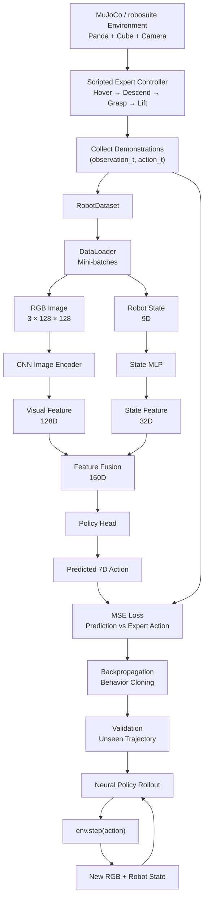

# 3D Multimodal Robot Learning

A 3D robot manipulation learning project using **MuJoCo**, **robosuite**, and **PyTorch**.

The project uses a simulated **Franka Panda** robot to learn a cube pick-up task from scripted expert demonstrations using behavior cloning.

## Project Pipeline



## Current System

The current learned policy takes:

```text
RGB Image
+
Robot Proprioception
        ↓
Visuomotor Policy
        ↓
7D Robot Action
```

The action space is:

```text
[dx, dy, dz, dRx, dRy, dRz, gripper]
```

## Scripted Expert

Before training the neural policy, a hand-written expert controller performs the pick-up task:

```text
Panda initial position
        ↓
Hover above cube
        ↓
Descend
        ↓
Close gripper
        ↓
Lift cube
```

The expert can access simulator information such as:

```text
cube_pos
gripper_to_cube_pos
```

These values are used only to generate demonstrations.

The neural policy itself does **not** receive the cube position directly.

## Demonstration Dataset

Each timestep stores three aligned pieces of data:

```text
image[t]
robot_state[t]
action[t]
```

Each demonstration therefore contains:

```text
(image_0, state_0) → action_0
(image_1, state_1) → action_1
(image_2, state_2) → action_2
...
```

Initial dataset:

```text
5 demonstrations
745 total timesteps

Images:
(745, 128, 128, 3)

Robot States:
(745, 9)

Actions:
(745, 7)
```

The 9D robot state contains:

```text
End-effector position      3D
End-effector quaternion    4D
Gripper joint position     2D
------------------------------
Total                       9D
```

## Neural Policy

### Vision Branch

```text
RGB Image
[3, 128, 128]
      ↓
CNN
      ↓
[64, 14, 14]
      ↓
Flatten
      ↓
12544
      ↓
Linear
      ↓
Visual Feature [128]
```

### Robot-State Branch

```text
Robot State [9]
      ↓
MLP
      ↓
State Feature [32]
```

### Feature Fusion

```text
Visual Feature [128]
        +
State Feature [32]
        ↓
torch.cat
        ↓
Combined Feature [160]
        ↓
Policy Head
        ↓
7D Action
```

With a batch size of 32:

```text
Images        [32, 3, 128, 128]
Robot States  [32, 9]

        ↓ Policy

Predictions   [32, 7]
```

## Behavior Cloning

The policy is trained using supervised imitation learning.

```text
RGB + Robot State
        ↓
Neural Policy
        ↓
Predicted Action
        ↓
     MSE Loss
        ↑
  Expert Action
        ↓
    backward()
        ↓
 optimizer.step()
```

During training, expert actions act as the target labels.

During rollout, the expert controller is removed.

## Training and Validation

Training trajectories:

```text
demo_000
demo_001
demo_002
demo_003
```

Validation trajectory:

```text
demo_004
```

The trajectories are separated at the episode level instead of randomly splitting individual frames, preventing neighboring frames from leaking between training and validation.

Initial training results:

```text
Epoch 0
Train Loss: 0.1542
Val Loss:   0.1533

Epoch 5
Train Loss: 0.0257
Val Loss:   0.0229

Epoch 19
Train Loss: 0.0047
Val Loss:   0.0561
```

The validation loss reaches its minimum around epoch 5, while the training loss continues decreasing afterward, indicating overfitting due to the small demonstration dataset.

## Current Progress

- [x] Panda simulation in MuJoCo / robosuite
- [x] 7D end-effector control
- [x] Closed-loop scripted expert
- [x] Cube grasp and lift
- [x] RGB camera observations
- [x] Robot proprioception
- [x] Expert demonstration collection
- [x] PyTorch Dataset
- [x] DataLoader batching
- [x] CNN visual encoder
- [x] Robot-state encoder
- [x] Multimodal feature fusion
- [x] 7D action prediction
- [x] Behavior cloning
- [x] Trajectory-level validation

## Next Steps

- [ ] Save the best validation checkpoint
- [ ] Expand to 30–50+ demonstrations
- [ ] Run the trained neural policy in closed loop
- [ ] Evaluate manipulation success rate
- [ ] Add multiple objects and tasks
- [ ] Add language conditioning
- [ ] Introduce temporal action prediction / action chunks
- [ ] Explore Transformer-based policies
- [ ] Explore flow-matching action generation

## Closed-Loop Goal

The next major milestone is to remove the scripted expert completely:

```text
Camera RGB
+
Robot State
        ↓
Trained Neural Policy
        ↓
Predicted 7D Action
        ↓
env.step(action)
        ↓
New RGB + Robot State
        ↓
Policy again
        ↺
```

The long-term goal is to extend the system toward:

```text
RGB
+
Language
+
Robot Proprioception
        ↓
Multimodal Robot Policy
        ↓
Action / Action Chunk
        ↓
3D Robot Manipulation
```

This project is an educational implementation of a modern robot-learning pipeline and is not intended to reproduce a large-scale state-of-the-art VLA model.
